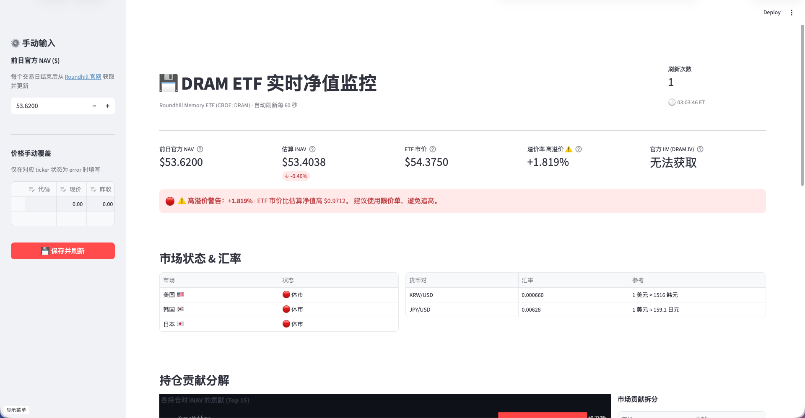
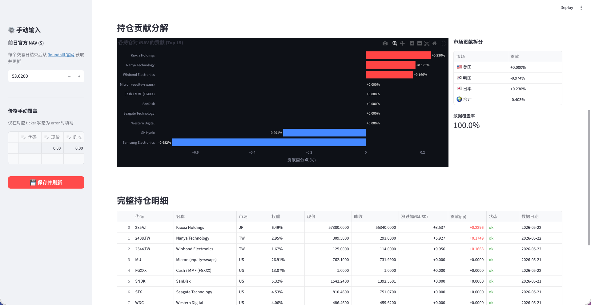

# 💾 DRAM ETF 实时净值监控

> **Roundhill Memory ETF（CBOE: DRAM）** 盘中 iNAV 估算与溢价率监控工具

DRAM ETF 持仓横跨美国、韩国、日本、台湾四个市场，官方 IIV 数据经常不可用，导致盘中很难判断是否在溢价成交。本工具通过抓取各成分股实时价格，自行估算 iNAV，并与 ETF 市价对比，帮助在正确价位下单。





---

## ✨ 功能

| 功能 | 说明 |
|------|------|
| **iNAV 实时估算** | 按持仓权重加权各成分股涨跌幅，推算当前净值 |
| **溢/折价率** | `(ETF市价 − iNAV) / iNAV`，彩色警示标签 |
| **时区感知计算** | 美股开市时全市场计入；美股休市时自动零化美股（已在 NAV），只计入韩/日/台实时波动 |
| **持仓贡献拆分** | 每只股票对 iNAV 的贡献 (pp)，横向柱状图直观展示 |
| **自动抓取持仓** | 从 Roundhill 官网获取最新权重，失败时使用内置备用数据 |
| **网页端输入 NAV** | 侧边栏直接填写前日官方 NAV，点击保存立即生效 |
| **手动价格覆盖** | 侧边栏可覆盖任意 ticker 的价格，yfinance 失效时备用 |
| **60 秒自动刷新** | 页面自动刷新，无需手动操作 |
| **CLI 模式** | 终端输出，支持循环刷新和 JSON 输出 |

---

## 🖥️ Streamlit Dashboard 界面

启动后页面分为以下区域：

**顶部指标栏**
```
前日官方 NAV  │  估算 iNAV (+7.07%)  │  ETF 市价  │  溢价率 +1.23% ⚠️  │  官方 IIV
```

**溢价率警示**
- 溢价 > 1.5%：红色警告横幅，提示避免追高
- 折价 < -1.5%：蓝色提示，可能存在买入机会
- ±0.5% 以内：绿色确认，接近净值

**持仓贡献图**（按贡献绝对值排序）
- 横向柱状图，红色 = 正贡献，蓝色 = 负贡献
- 右侧按市场拆分：美股 / 韩股 / 日股贡献汇总

**完整持仓明细表**
```
代码        名称              市场   权重     现价      昨收      涨跌幅    贡献(pp)  状态   数据日期
000660.KS   SK Hynix          KR    26.75%   194100   194000   +0.31%   +0.083    ok    2026-05-22 ← 亚洲开市时计入
MU          Micron(equity+…   US    26.91%   105.00  100.00   +5.00%   +0.000    ok    2026-05-21 ← 美股休市时贡献=0（已在 NAV）
```
注：同一支股票在不同时段贡献可能不同。美股开市时 MU 的 +5% 会被计入；美股休市时虽显示 +5% 但对 iNAV 的贡献为 0（避免重复）。

**左侧边栏（⚙️ 手动输入）**
- 前日官方 NAV 输入框
- 价格手动覆盖表格（可动态增删行）
- 「保存并刷新」按钮 — 写入本地 `overrides.json`，即时生效

---

## 📋 前置要求

- Python **3.10+**
- 网络能访问 Yahoo Finance（yfinance）
- **可选**：Finnhub API Key（免费，用于美股休市时备用价格源；无 key 时仍可正常运行，仅使用 yfinance）

---

## 🚀 快速启动

```bash
# 1. 克隆项目
git clone https://github.com/<your-username>/dram-monitor.git
cd dram-monitor

# 2. 安装依赖（建议用 venv）
python -m venv .venv
source .venv/bin/activate   # Windows: .venv\Scripts\activate
pip install -r requirements.txt

# 3. 启动
streamlit run app.py
```

浏览器自动打开 `http://localhost:8501`。

---

## 📅 每日使用流程

每个美股交易日只需一步操作：

1. 打开 [Roundhill 官网](https://www.roundhillinvestments.com/etf/dram/) → 找到 **NAV** 数值（如 `$49.77`）
2. 在 Dashboard **左侧边栏** 的「前日官方 NAV」输入框填入该数值
3. 点击「💾 保存并刷新」

之后页面每 60 秒自动刷新，iNAV 和溢价率会持续更新，无需再操作。

> NAV 数值保存在本地 `overrides.json`，重启后仍然有效，下个交易日更新一次即可。

---

## 💻 CLI 用法

```bash
# 单次输出（查看当前快照）
python cli.py

# 每 N 秒循环刷新（类 watch 命令）
python cli.py --watch 60

# 输出 JSON（接管道、写日志）
python cli.py --json

# 输出 JSON 并循环
python cli.py --json --watch 120

# 显示调试日志（排查数据问题）
python cli.py --log
```

CLI 输出示例：
```
================================================================
  💾  DRAM ETF 净值监控  |  2026-05-22 10:35:12 ET
  北京时间: 2026-05-22 22:35:12
================================================================
  前日官方 NAV    :             $49.7700
  估算 iNAV       :    $50.2134  (+0.890%)
  官方 IIV         :              不可用
  ETF 市价         :             $50.4500
  溢/折价率        :    +0.469%  接近净值 ✓

  市场状态: 美国 🟢 开市  |  韩国 🔴 休市  |  日本 🔴 休市  |  台湾 🔴 休市
  当前计入: 🇺🇸 美国 + 🇰🇷 韩国（今日收盘）+ 🇯🇵 日本（今日收盘）+ 🇹🇼 台湾（今日收盘）

  持仓明细 (按贡献排序):
  代码           名称                       权重    涨跌幅    贡献   市场
  -----------------------------------------------------------------------
  000660.KS      SK Hynix                  26.75%  +0.31%  +0.0830   KR
  …
```

---

## 🧮 iNAV 计算原理

```
estimated_iNAV = previous_NAV × (1 + Σ weight_i × USD_return_i)

USD_return_i = (1 + local_return_i) × (1 + fx_return_i) − 1
```

| 变量 | 含义 |
|------|------|
| `local_return_i` | 成分股本地货币当日涨跌幅（直接取 yfinance 的 change_pct） |
| `fx_return_i` | 当日汇率变动，仅 KRW/JPY/TWD 生效（USD 为 0） |
| `previous_NAV` | 上一交易日官方净值（用户每日从 Roundhill 官网更新） |

**多市场时区感知逻辑**（核心优化）

DRAM ETF 跨越四个时区，官方 NAV 每日美股收盘后发布，已经包含了当日美股和亚洲股的收盘价。iNAV 计算需要根据当前时段避免重复计入：

| 时段 | 美股状态 | 亚洲状态 | iNAV 处理 |
|------|---------|---------|----------|
| **美股开市**（ET 9:30–16:00）| 🟢 实时交易 | 🔴 已收盘 | 美股＋亚洲全部计入 ✅ |
| **亚洲开市**（美股休市）| 🔴 休市 | 🟢 实时交易 | 只计入亚洲，美股 = 0%（已在 NAV）⏸️ |
| **美股收盘后**（4–8pm ET）| 🔴 刚收盘 | 🔴 尚未开 | 今日美股＋亚洲前日收盘全部计入 ✅ |

**实现细节**

价格来源（三层优先级）：
1. **yfinance（1min）**：美股交易时段 → 取实时价；闭市后 → 检查是否有今日完整交易数据（`has_intraday`）
2. **Finnhub API（秒级）**：美股休市时作备用 → 检查报价时间戳（Unix `t`）是否来自今日（ET 时区），若来自昨日则强制 `has_intraday=False`
3. **外国股市本地源**（Naver/TWSE/Minkabu）：自动取当日最新价格

美股贡献零化规则：
```python
if market == "US" and (not us_market_open) and (not has_intraday):
    usd_return = 0.0  # 避免重复计入昨日美股涨跌
```

这样即使 Finnhub 在美股休市时返回的报价是 `c=昨收, pc=前天收`（涨跌幅 = 昨日汇率），也会被正确识别为陈旧数据并归零。

---

## 📊 数据来源

| 数据 | 来源 | 更新频率 | 备注 |
|------|------|----------|------|
| 持仓权重 | Roundhill 官网 CSV（程序自动抓取，4h 缓存）| 每个交易日 | 失败时使用备用持仓 |
| 美股实时价 | yfinance 1min | 约 1 分钟延迟 | 开市时段 |
| 美股休市价 | Finnhub API（可选）→ yfinance | 秒级 | yfinance 超时降级 |
| 韩/日/台股价 | yfinance 60min＋本地源（Naver/TWSE/Minkabu）| 当日收盘后固定 | 多源容错 |
| 汇率（KRW/JPY/TWD）| 免费 FX API（open.er-api.com）| 约 5 分钟延迟 | 无需 Key |
| ETF 市价 | yfinance 1min | 约 1 分钟延迟 | - |
| 前日官方 NAV | 用户手动输入 → Roundhill CSV 自动抓取 | 每个交易日 | 自动优于手动 |

> **必须**：[yfinance](https://github.com/ranaroussi/yfinance) 免费无 Key
> 
> **可选**：[Finnhub API](https://finnhub.io) Free Plan（60次/min）用于美股休市时备用

---

## ⚙️ 配置说明

**环境变量（`.env`）**

```bash
# 可选：Finnhub API Key（美股休市时备用数据源）
FINNHUB_API_KEY=your_key_here   # 免费注册：https://finnhub.io（60次/分钟）
```

**常量配置（`config.py`）**

```python
REFRESH_INTERVAL_SEC = 60          # 刷新间隔（秒）

ZERO_RETURN_TICKERS = {"FGXXX", …} # 现金/货币基金，固定 0% 日收益

MANUAL_PRICE_OVERRIDES = {          # 备用：yfinance 无法获取时手动填写
    # "285A.T": {"price": 55670.0, "prev_close": 51290.0, "currency": "JPY"},
}

FALLBACK_HOLDINGS = [               # 官网抓取失败时的备用持仓（定期更新）
    {"ticker": "000660.KS", "name": "SK Hynix", "weight": 0.2675, "market": "KR"},
    …
]

MANUAL_NAV_OVERRIDE = None          # 强制使用此 NAV（用于官网无法自动抓取时）
```

**运行时覆盖（`overrides.json`）**

点击 Dashboard 侧边栏「保存并刷新」按钮后自动生成：
- `manual_nav`：输入的前日官方 NAV
- `manual_prices`：手动覆盖的股票价格

---

## 🌐 VPS 部署

```bash
# screen 快速挂载
screen -S dram
streamlit run app.py --server.port 8501 --server.headless true
# Ctrl+A D 挂起，连接断开后继续运行
```

<details>
<summary>systemd service（推荐生产环境）</summary>

```ini
# /etc/systemd/system/dram-monitor.service
[Unit]
Description=DRAM ETF Monitor
After=network.target

[Service]
User=ubuntu
WorkingDirectory=/path/to/dram-monitor
ExecStart=streamlit run app.py --server.port 8501 --server.headless true
Restart=always
RestartSec=10

[Install]
WantedBy=multi-user.target
```

```bash
sudo systemctl enable dram-monitor
sudo systemctl start  dram-monitor
sudo systemctl status dram-monitor
```

</details>

---

## ⚠️ 免责声明

本工具仅供个人学习与交易参考，iNAV 为估算值，非官方净值，与实际净值存在误差。市场数据有延迟，任何投资决策请自行承担风险。
